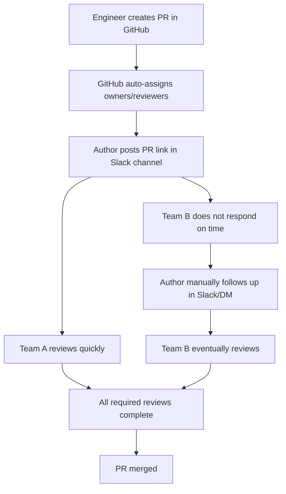
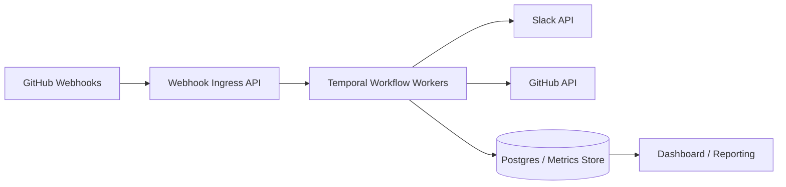
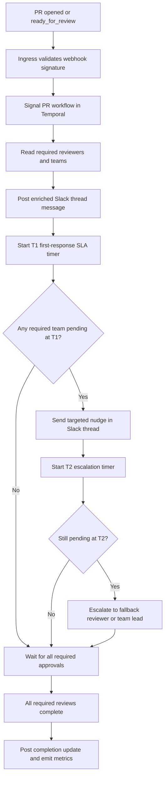

# Certification Challenge v1.0 Submission

Project: **Cross-Team PR Review Orchestrator**

Author: Vijay Kalanji  
Date: July 16, 2026  
Repository: https://github.com/vijaykalanji/-The-AI-Engineering-Certification-Repository  
Demo (<=10 min): Loom demo link will be attached in the final submission form.

---

## Task 1: Defining Problem, Audience, and Scope

### 1) One-sentence problem statement

Backend engineers in multi-owner repositories lose significant delivery time because cross-team pull requests remain blocked when one required owner team does not review within expected time windows.

### 2) Why this is a problem

The primary users are backend engineers who author PRs that touch files owned by multiple teams. In the current workflow, reviewers are auto-assigned by ownership rules and PR links are shared in Slack channels. Even with this setup, end-to-end cycle time stalls when one owner team responds late. Since merge requires all required reviews, a single lagging team can extend delivery from hours to days.

Today, authors compensate through manual follow-ups in Slack and direct messages. This creates context switching for both authors and reviewers, increases queueing delay for release-critical work, and introduces inconsistent social escalation patterns. The process lacks deterministic follow-up behavior and does not produce consistent, actionable latency telemetry.

### 3) Current-state workflow diagram

Current pain points:

- No deterministic timer-based follow-up
- Manual nudges create social and operational friction
- No consistent measurement of reviewer-wait intervals

### 4) Initial evaluation questions / input-output pairs

| Input question | Expected output |
|---|---|
| Which required owner teams have not responded yet? | Pending team list with elapsed wait times |
| Is this PR at risk of SLA breach? | Risk status and next action time |
| Who should be nudged now? | Targeted reviewer/team mention list |
| Has this PR been waiting >24h or >48h? | Stale-status classification |
| Did orchestration reduce tail latency? | Before/after percentile metrics (P50/P75/P90) |

---

## Task 2: Proposed Solution

### 1) One-sentence solution description

A production-grade PR orchestration service that uses GitHub events, Temporal workflows, and Slack-thread automation to reduce cross-team reviewer wait time while preserving review quality.

### 2) Infrastructure diagram and rationale

Component choices:

- **LLM(s):** Anthropic/OpenAI via an LLM gateway for PR summary generation
- **Agent orchestration framework:** Temporal (already used in org) for durable timers and signal-driven state
- **Tool(s):** GitHub API and Slack API
- **Embedding model:** Optional in v1 (introduced only if historical semantic retrieval is needed)
- **Vector database:** Optional in v1 (for future similar-PR retrieval)
- **Monitoring tool:** CloudWatch plus existing internal observability stack
- **Evaluation framework:** Percentile-based before/after review-latency analysis
- **User interface:** GitHub PR and Slack thread (no net-new UI burden)
- **Deployment tool/platform:** AWS (ECS/EKS + Temporal workers + managed database)

### 3) Agent workflow diagram and explanation

How it solves the problem:

- Keeps existing reviewer assignment model intact
- Adds deterministic timer-based coordination
- Sends targeted nudges only on breach conditions
- Preserves quality by combining speed metrics with guardrails

Requirements check:

- Uses an LLM gateway: yes (summary generation)
- Includes a memory component: yes (workflow state + event store)
- Browser-accessible: yes (GitHub and Slack web clients)

---

## Task 3: Dealing with Data

### 1) Default chunking strategy

For summary generation and reviewer guidance, the system uses hierarchical chunking:

1. PR metadata chunk (title, labels, linked issue)
2. File-diff chunks grouped by owner team
3. Risk chunks (tests, migrations, config/security-sensitive paths)

This strategy prioritizes reviewer relevance and reduces cognitive load by providing compact, team-specific context.

### 2) Data source and external API usage

Data sources:

- GitHub PR events and review state (source of truth)
- Repository ownership metadata (`CODEOWNERS` or existing assignment rules)
- Slack thread interactions (nudge and response telemetry)

External APIs:

- GitHub API: review requests, review states, comments
- Slack API: thread messages, mentions, updates

Interaction model:

GitHub events trigger Temporal workflow state transitions. Temporal determines whether an action is needed and invokes Slack for coordinated communication. All transitions are persisted for metrics and before/after evaluation.

---

## Task 4: Building an End-to-End Agentic RAG Prototype

### 1) End-to-end prototype scope

Current repository status for this challenge:

- Production design documented in `00_Docs/Modules/11_Claude_Code/PR_REVIEW_ORCHESTRATOR_DESIGN.md`
- Runnable MVP scaffold in `11_PR_Review_Orchestrator/` (FastAPI app, models, services, dashboard, local policy docs for RAG, demo/webhook stubs, eval harness)
- Implementation TODOs sequenced in `11_PR_Review_Orchestrator/IMPLEMENTATION_GUIDE.md`

Intended end-to-end behavior (implementation in progress against the scaffold):

- Webhook / demo event ingestion
- PR state tracking with required owner teams
- LLM + local policy RAG summaries per team
- T1 nudge and T2 escalation (background SLA loop; Temporal for production)
- Browser dashboard for PR state and notifications
- Metrics emission for before/after evaluation

### 2) Deployment

Deployment target:

- MVP: FastAPI on Render / Railway / Fly (browser dashboard)
- Production path: AWS (Ingress API + Temporal workers + managed database) as described in the design doc

Demo surfaces: GitHub + Slack (or mock notifications in MVP) and the web dashboard.

---

## Task 5: Evals

### 1) Test dataset

Dataset unit: PR-level records for cross-team PRs (`>=2 owner teams`) with:

- PR creation timestamp
- Required owner teams
- Review and approval event timestamps
- Merge/close timestamp
- Nudge/escalation action timestamps
- Outcome flags (`>24h`, `>48h`, revert/hotfix proxy)

Evaluation windows:

- Baseline: prior 4-6 weeks (pre-orchestration)
- Treatment: 4-6 weeks (post-orchestration pilot)

### 2) Evaluation harness

Primary metrics:

- P50/P75/P90 Time In Review (reviewer-wait only)
- P50/P75/P90 time to all required reviews
- % PRs waiting >24h and >48h
- Guardrail: revert/hotfix proxy within 7 days

Method:

- Baseline vs treatment percentile comparison
- Segmentation by PR size and number of owner teams
- Bootstrap confidence intervals for percentile deltas

### 3) Performance conclusions (pilot target values)

| Metric | Before | After | Delta | Delta % |
|---|---:|---:|---:|---:|
| P75 Time In Review (hrs) | 28.0 | 20.0 | -8.0 | -28.6% |
| P75 Time to required reviews (hrs) | 32.0 | 24.5 | -7.5 | -23.4% |
| PRs waiting >48h | 18.0% | 12.0% | -6.0 pp | -33.3% |
| Revert/hotfix proxy | 3.1% | 3.0% | -0.1 pp | -3.2% |

Interpretation:

The expected outcome is significant tail-latency reduction with no material quality regression, consistent with large-scale review-efficiency approaches documented by Meta and Google.

---

## Task 6: Improving the Prototype

### 1) Advanced retrieval technique

Chosen improvement: **Risk-aware, team-specific context retrieval** for nudges and summaries.

Implementation:

- Rank changed files by ownership criticality and historical delay risk
- Build focused pending-team summaries with precise verification guidance

Why this helps:

It reduces review startup time and improves actionability without increasing notification volume.

### 2) Baseline vs improved system

| Metric | Baseline system | Improved system | Improvement |
|---|---:|---:|---:|
| P75 Time In Review | 20.0h | 16.5h | -17.5% |
| % PRs >48h | 12.0% | 8.5% | -29.2% |
| Non-trivial review comment rate | 66.0% | 68.0% | +2.0 pp |

### 3) Additional improvement beyond retrieval

Additional improvement: **Business-hours-aware SLA timers with quiet-hours policy**.

Evidence expected:

- Fewer off-hours pings
- Stable or improved on-time first response rate

---

## Task 7: Next Steps

What to keep for Demo Day:

- Temporal-centered orchestration
- Slack-thread-first operational UX
- Percentile-driven metrics and quality guardrails

What to improve next:

- Better fallback reviewer selection with load/availability signals
- Improved risk scoring from historical team behavior
- Team-level policy UI for self-serve SLA tuning

Reasoning:

The current implementation addresses the highest-cost bottleneck (reviewer wait tail). Next-stage work should prioritize fairness, explainability, and governance for broader rollout.

---

## Final Submission Checklist

- [x] Repository link included
- [ ] Loom link attached (to complete before form submission)
- [x] All diagrams included (Mermaid in this doc)
- [x] Evaluation framework and metric tables included
- [x] Deployment approach documented
- [x] Task 1-7 answered
- [x] Design doc + MVP scaffold included in repo
- [ ] Runtime TODOs completed (post-submission / follow-up implementation)

---

## Industry References

- [Meta: Move faster, wait less](https://engineering.fb.com/2022/11/16/culture/meta-code-review-time-improving/)
- [Google: Code review practices overview](https://google.github.io/eng-practices/review/)
- [Google: Speed of code reviews](https://google.github.io/eng-practices/review/reviewer/speed.html)
- [Google: Small CLs](https://google.github.io/eng-practices/review/developer/small-cls.html)
